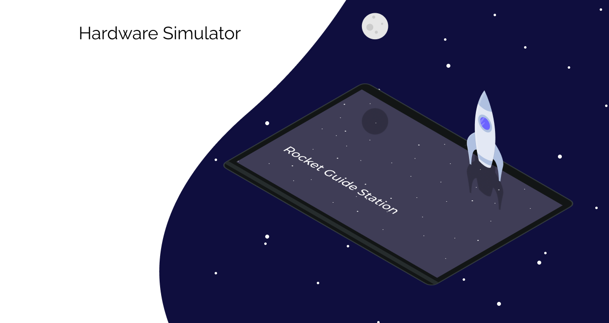

Repositório utilizado para criação do script de simulação do hardware.

[](https://opensource.org/licenses/MIT)

## Documentação

A documentação do projeto está disponível no repositório está disponível [AQUI!](https://github.com/Ground-Station/Documentation)

## Uso

Para utilizar o script, basta executar o docker-compose na pasta raiz do projeto com o comando:

```
$sudo docker-compose up --build
```

## Resultado 

O resultado deve ser um arquivo `.txt` criado na pasta scripts.

## Configuração

A simulação está programada com os seguintes parâmetros:
```
// fueling
var fuelingDuration = 2; // in minutes
var fuelingDataPerSecond = 2;
var fuelingDataAmount = 60*fuelingDataPerSecond*fuelingDuration;
// flight
var flightDuration = 8; // in minutes
var flightDataPerSecond = 1;
var flightDataAmount = 60*flightDataPerSecond*flightDuration;
```

Onde a duração do abastecimento(`fuelingDuration`) e a duração do voo(`flightDuration`) é dada em minutos.
A quantidade de dados da ignição(`fuelingDataAmount`) e do voo(`flightDataAmount`) é definida a partir da duração e da quantidade de dados por segundo. 

### OBS:
Os valores definidos foram testados para estarem de acordo com os dados produzidos em uma missão real, a alteração deles implica na alteração dos valores gerados e pode gerar divergências.
